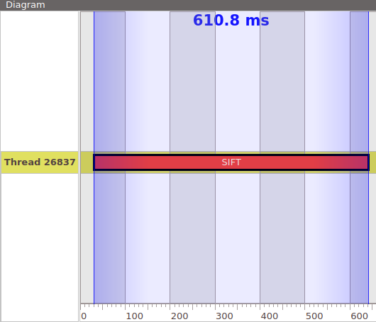
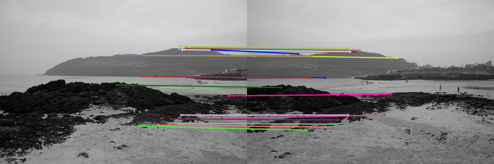
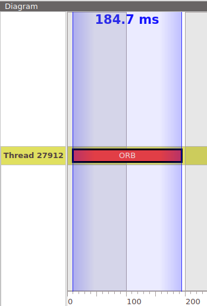
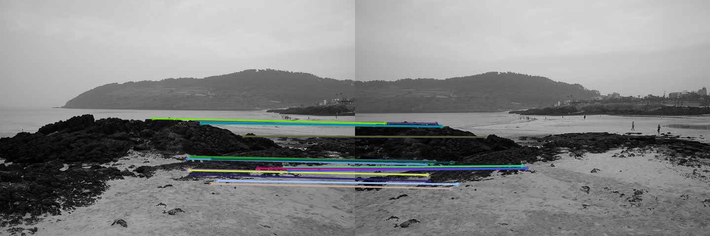
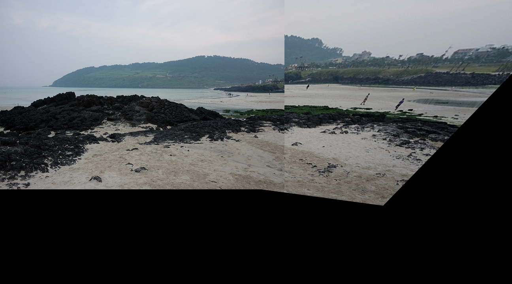
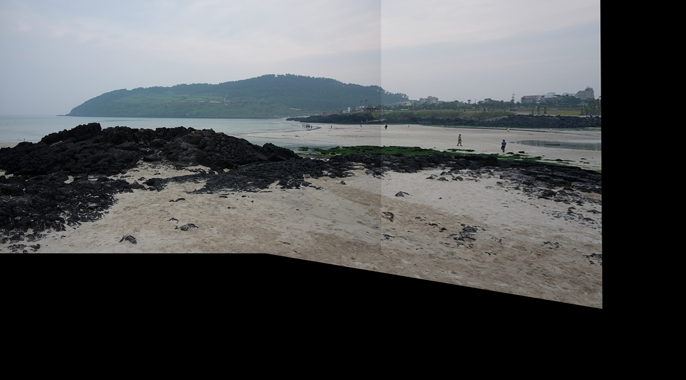

# Stitching Implementation
> ## 사용 라이브러리
> Opencv without Stitching API

## 과정 설명
### 1. **ORB**와 **SIFT**를 사용하여, 두 사진의 **Feature Points**를 검출.
```
  cv::Ptr<cv::Feature2D> detector = cv::SIFT::create();
  // cv::Ptr<cv::Feature2D> detector = cv::ORB::create();

  cv::Mat desc1, desc2;
  std::vector<cv::KeyPoint> keypoints1, keypoints2;

  detector->detectAndCompute(src1, cv::Mat(), keypoints1, desc1);
  detector->detectAndCompute(src2, cv::Mat(), keypoints2, desc2);
```
### 2. 검출된 Feature Points들을 **FlannBasedMatcher**를 사용해 매칭.
```
  cv::Ptr<cv::DescriptorMatcher> matcher = cv::FlannBasedMatcher::create();
  std::vector<cv::DMatch> matches;
  matcher->match(desc1, desc2, matches);
```
### 3. 매칭된 매치들의 Distance가 작은 순부터 20개의 포인트로 **필터링**.
```
  std::sort(matches.begin(), matches.end());
  std::vector<cv::DMatch> good_matches(matches.begin(), matches.begin() + 20);
```
### 4. 매칭된 이미지 픽셀의 좌표들을 사용해 **Homograpy** 계산.
```
  std::vector<cv::Point2f> pts1, pts2;
  for (size_t i = 0; i < good_matches.size(); i++) {
    pts1.push_back(keypoints1[good_matches[i].queryIdx].pt);
    pts2.push_back(keypoints2[good_matches[i].trainIdx].pt);
  }
  cv::Mat H = cv::findHomography(pts2, pts1, cv::RANSAC);
```
### 5. **Homograpy**를 사용해 이미지를 **Stitching**.

## 결과
### 1. SIFT





20개의 필터링된 포인트들 만으로도 RANSAC을 통해 Homography가 잘 추출되어 스티칭이 잘 된다. 하지만 시간이 오래 걸린다.

### 2. ORB








시간은 3배 감소 하였지만 필터링된 20개의 포인트로는 Homography가 잘 추출되지 않으며, 필터링 되지 않은 포인트들로는 스티칭이 잘 이루어졌다.
