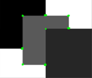

# FAST Corner Detection 1998 (Trajkovic’s corner)

# 1. Goal of Project
This project is for implement FAST Corner Detection algorithm based on Miroslav Trajkovii' paper.   
[see the paper](https://www.researchgate.net/profile/Miroslav-Trajkovic/publication/223831601_Fast_Corner_Detection/links/5a56774645851547b1bf1d34/Fast-Corner-Detection.pdf)  

  

# 2. How to Run
command below example.
```bash
$ ./build/corner_detection {image_path} {resize factor 0.5 or 0.25} {thereshold1} {thereshold 2} {Interpixel approximation method (linear or circular)}
EX
$ ./build/corner_detection sources/test1.bmp 0.25 50 80 linear
```

# 3. Limitations
## 1. Non-Maximamum-Suppression
To remove overlapping corners, this paper suggests to use NMS.  
However I haven't make this yet. 
I would keep developing it too.

## 2. Non-automatic Threshold Selection (Heuristic method)
To find optimal Corner, we need to find proper threshold heuristically
